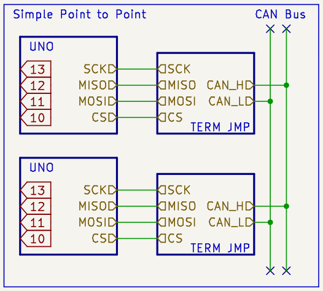
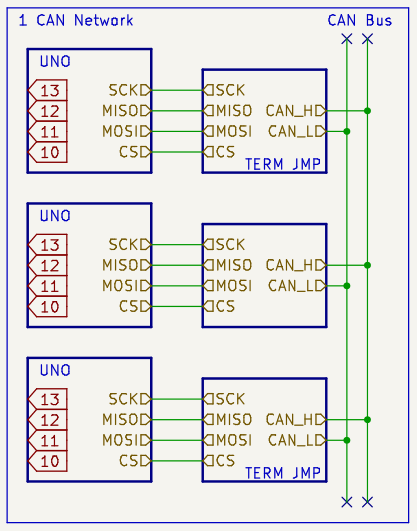
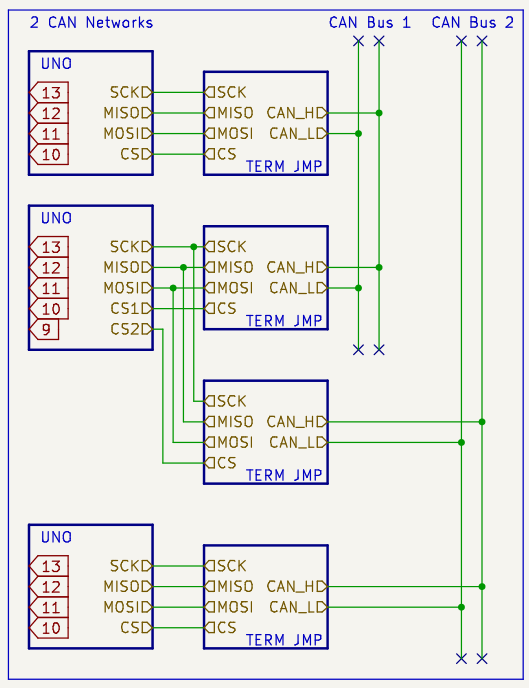

# NVF2-DA-Exploring-CanBus

Some sample testing and debugging codes for CAN Bus Module MCP2515 with the following controllers:

| Controller                 | Status |
|----------------------------|:------:|
| Arduino UNO                |   ✅    |
| WeAct Bluepill [STM32F103] |   ✅    |
| WeAct Raspberry Pi Pico    |   ❌    |

### 1.0.1. Technical Documentaion
Read the [Technical Documentations...](./technical.md)

## 1.1. Current Status

This project is still a WIP.

- For `Arduino UNO`, code has been tested and is working.
- For the `other controllers`, there are multiple SPI interfaces as well as multiple pins muxed into single SPI buses. it is not yet known to us on how we will be able to choose the SPI pins on the other boards.

## 1.2. Examples

Apart from bare bones `tx` and `rx` examples for using NVF_CAN wrappers, we also have examples for:

| Example                                                       |       Status        | UNO |  Bluepill  |
|---------------------------------------------------------------|:-------------------:|:---:|:----------:|
| [CAN RX -> LCD](./NVF2-CanBus/examples/main_rx_lcd.cpp)       | Tested and Working* |  ✅  | Not Tested |
| [Counter -> CAN TX](./NVF2-CanBus/examples/main_tx.cpp)       | Tested and Working* |  ✅  |     ✅      |
| [Analog -> CAN TX](./NVF2-CanBus/examples/main_tx_analog.cpp) | Tested and Working* |  ✅  |     ✅      |

\* only some controllers

## 1.3. Proposed Examples

This project started to test the capbilities of CanBus for a car. here are some examples of capabilites we will want to test with this project.

| Capability                                            | Status |
|-------------------------------------------------------|:------:|
| [Point to Point CAN](#point-to-point-can-2-nodes)     |   ✅    |
| [1 CAN Network](#1-proper-can-network)                |   ✅    |
| [Multiple CAN Networks](#1-controller-2-can-networks) |   ✅    |

### 1.3.1. Point to Point CAN (2 Nodes)

the most basic example of connecting 2 CAN Nodes together.

### 1.3.2. 1 Proper CAN Network

Normal operation of 1 CAN Network where ALL nodes are on the same CAN Bus

### 1.3.3. 1 Controller, 2 CAN Networks

Special operation where 1 CAN Node on the Network will act as a pass through to a seperate dedicated CAN Bus network.

