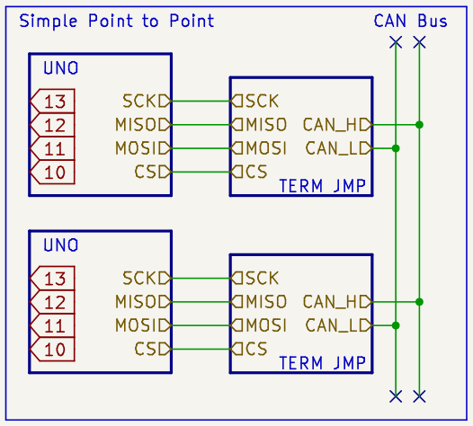
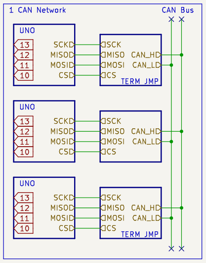
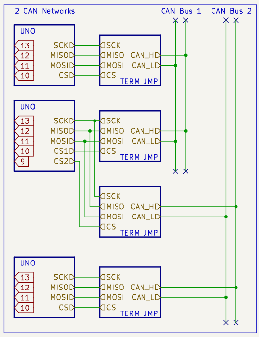

# NVF2-DA-Exploring-CanBus

Some sample testing and debugging codes for CAN Bus Module MCP2515 with the following controllers:

### Technical Documentaion

Read the [Technical Documentations...](./technical.md)

## Current Status

| Controller                 | Status |
|----------------------------|:------:|
| Arduino UNO                |   ✅    |
| WeAct Bluepill [STM32F103] |   ✅    |
| WeAct Raspberry Pi Pico    |  WIP   |

## Examples

Apart from bare bones `tx` and `rx` examples for using NVF_CanBus wrappers, we also have examples for:

| Example                                     | UNO |  Bluepill  |
|---------------------------------------------|:---:|:----------:|
| [CAN RX -> LCD](../examples/rx-lcd/)        |  ✅  | Not Tested |
| [CAN RX -> Serial](../examples/rx-lcd/)        |  ✅  | Not Tested |
| [Counter -> CAN TX](../examples/tx-simple/) |  ✅  |     ✅      |
| [Analog -> CAN TX](../examples/tx-analog/)  |  ✅  |     ✅      |

## Additional Examples

Apart from individual capabilities of a CanBus node as [demostrated above](#examples), here are some combinations of how muliple CanBus nodes can be hooked up and used.

| Capability                                                      | Status |
|-----------------------------------------------------------------|:------:|
| [Simplest CAN Network](#simplest-can-network)                   |   ✅    |
| [Normal Operating CAN Network](#normal-operating-can-network)   |   ✅    |
| [Multiple CAN Networks](#multiple-can-networks-on-1-controller) |   ✅    |

### Simplest CAN Network

the most basic example of connecting 2 CAN Nodes together.

### Normal Operating CAN Network

Normal operation of 1 CAN Network where ALL nodes are on the same CAN Bus

### Multiple CAN Networks on 1 Controller

Special operation where 1 CAN Node on the Network will act as a pass through to a seperate dedicated CAN Bus network.

